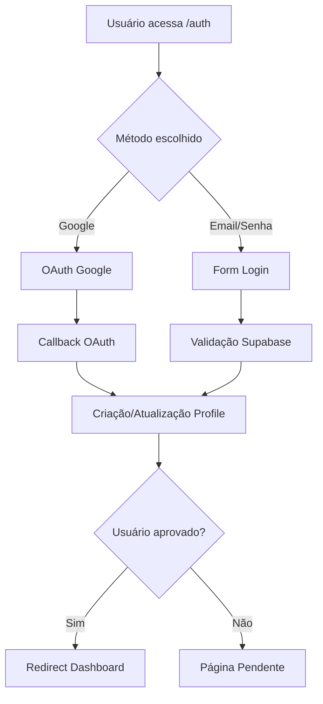
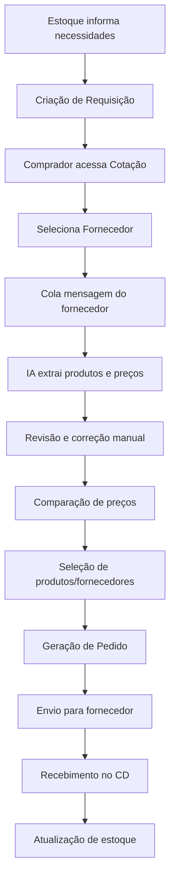
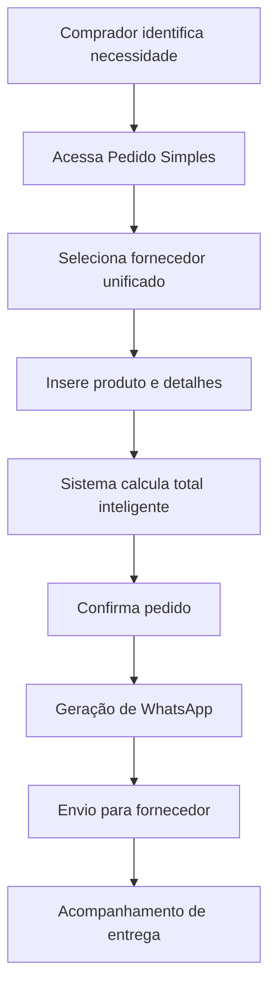
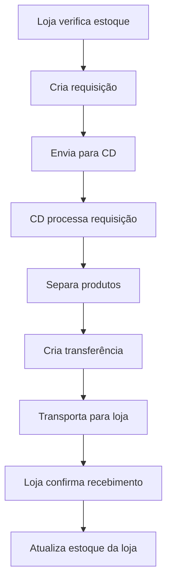
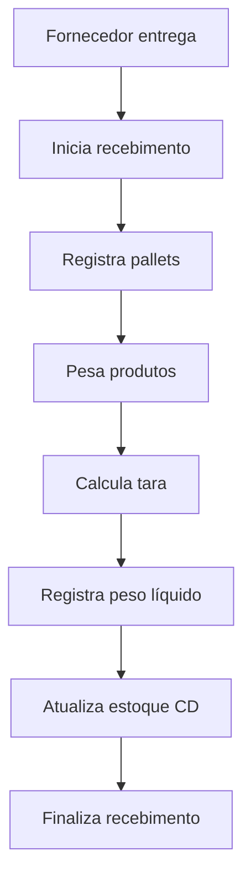

# Documentação Completa do Sistema FLV - Supermercado Dalpozzo

## Índice
1. [Visão Geral](#visão-geral)
2. [Arquitetura do Sistema](#arquitetura-do-sistema)
3. [Autenticação e Segurança](#autenticação-e-segurança)
4. [Gerenciamento de Usuários e Permissões](#gerenciamento-de-usuários-e-permissões)
5. [Módulos Funcionais](#módulos-funcionais)
6. [Estrutura do Banco de Dados](#estrutura-do-banco-de-dados)
7. [Fluxos de Trabalho](#fluxos-de-trabalho)
8. [Sistema de IA e Aprendizado](#sistema-de-ia-e-aprendizado)
9. [API e Integrações](#api-e-integrações)
10. [Interface do Usuário](#interface-do-usuário)
11. [Configurações e Manutenção](#configurações-e-manutenção)
12. [Troubleshooting e Logs](#troubleshooting-e-logs)

---

## Visão Geral

### Objetivo
O Sistema FLV é uma aplicação web desenvolvida especificamente para digitalizar e otimizar o processo completo de compras de frutas, legumes e verduras (FLV) do Supermercado Dalpozzo. O sistema substitui processos manuais tradicionais (papel, caneta, impressões) por um fluxo digital completo, integrado e inteligente.

### Principais Benefícios
- **Digitalização Completa**: Eliminação total de processos manuais
- **Automatização Inteligente**: IA para leitura automática de mensagens de fornecedores
- **Comparação de Preços**: Interface visual avançada para comparação entre fornecedores
- **Gestão Centralizada**: Controle unificado de estoque, requisições, pedidos e recebimentos
- **Rastreabilidade**: Histórico completo e auditoria de todas as operações
- **Sistema de Aprendizado**: IA que aprende e melhora com o uso
- **Multi-loja**: Suporte completo para várias lojas e centro de distribuição

### Tecnologias Utilizadas
- **Frontend**: React 18 + TypeScript + Vite
- **Styling**: Tailwind CSS + shadcn/ui + Design System customizado
- **Backend**: Supabase (PostgreSQL + Edge Functions + Real-time)
- **Autenticação**: Supabase Auth (Google OAuth + Email/Password)
- **Estado**: React Hooks + Context API + React Query
- **Roteamento**: React Router v6
- **IA**: Web Workers + Pattern Recognition + Machine Learning
- **Performance**: Lazy Loading + Code Splitting + Memoization

---

## Arquitetura do Sistema

### Estrutura Geral
```
Sistema FLV
├── Frontend (React/TypeScript)
│   ├── Pages (Páginas principais)
│   ├── Components (Componentes reutilizáveis)
│   │   ├── UI (shadcn/ui customizados)
│   │   ├── cotacao (Sistema de cotações)
│   │   ├── configuracoes (Gestão de configurações)
│   │   ├── historico (Visualização de históricos)
│   │   ├── pedidos (Gestão de pedidos)
│   │   ├── recebimento (Sistema de recebimento)
│   │   ├── requisicoes (Sistema de requisições)
│   │   └── transferencias (Gestão de transferências)
│   ├── Hooks Customizados
│   ├── Contextos (Autenticação e estado global)
│   ├── Services (Serviços de IA e extração)
│   └── Utils (Utilitários e validações)
├── Backend (Supabase)
│   ├── Banco de Dados (PostgreSQL com 25+ tabelas)
│   ├── Autenticação (Multi-provider)
│   ├── Edge Functions (Processamento serverless)
│   ├── Row Level Security (RLS em todas as tabelas)
│   ├── Real-time (Sincronização em tempo real)
│   └── Triggers e Functions (Automação)
└── Integrações
    ├── Google OAuth (Autenticação)
    ├── WhatsApp (Geração de mensagens)
    └── Sistema de IA (Extração e aprendizado)
```

### Padrões Arquiteturais
- **MVC Pattern**: Separação clara entre lógica, dados e apresentação
- **Hooks Pattern**: Lógica reutilizável através de custom hooks
- **Context Pattern**: Gerenciamento de estado global
- **Observer Pattern**: Real-time updates com Supabase
- **Strategy Pattern**: Diferentes estratégias de extração de dados
- **Factory Pattern**: Criação de componentes dinâmicos
- **Security by Design**: RLS em todas as tabelas críticas

---

## Autenticação e Segurança

### Sistema de Autenticação
O sistema utiliza **Supabase Auth** com arquitetura multi-provider:

#### Métodos de Login
1. **Google OAuth** (Principal)
   - Integração com Google Cloud Platform
   - Redirecionamento automático pós-login
   - Sincronização de perfil do Google
   - Rate limiting implementado

2. **Email/Senha** (Secundário)
   - Validação robusta de credenciais
   - Recuperação de senha via email
   - Proteção contra ataques de força bruta

#### Fluxo de Autenticação


#### Segurança Implementada
- **Row Level Security (RLS)**: Todas as 25+ tabelas protegidas
- **JWT Tokens**: Renovação automática e validação
- **Session Management**: Controle de sessão persistente
- **CORS Protection**: Headers de segurança configurados
- **Rate Limiting**: Proteção contra spam e ataques
- **Input Validation**: Sanitização de todos os inputs
- **SQL Injection Protection**: Prepared statements

### Contexto de Autenticação (`AuthContext`)
```typescript
interface AuthContextType {
  user: User | null;
  profile: UserProfile | null;
  session: Session | null;
  loading: boolean;
  signInWithGoogle: () => Promise<{success: boolean; error?: string}>;
  signOut: () => Promise<void>;
  hasRole: (role: string) => boolean;
}
```

---

## Gerenciamento de Usuários e Permissões

### Hierarquia de Usuários
O sistema implementa 4 tipos de usuários com diferentes níveis de acesso:

#### 1. **Master** 
- **Acesso**: Total ao sistema
- **Permissões**: Todas as funcionalidades + configurações críticas
- **Responsabilidades**: 
  - Administração geral
  - Aprovação de usuários
  - Configurações do sistema
  - Gestão de permissões
  - Backup e manutenção

#### 2. **Comprador**
- **Acesso**: Cotações, requisições, pedidos, históricos
- **Permissões**: Criar/editar cotações, gerenciar fornecedores
- **Responsabilidades**: 
  - Processo completo de compras
  - Negociação com fornecedores
  - Análise de preços
  - Geração de pedidos

#### 3. **Estoque**
- **Acesso**: Estoque, requisições
- **Permissões**: Atualizar estoque, criar requisições
- **Responsabilidades**: 
  - Controle de estoque por loja
  - Criação de requisições
  - Monitoramento de produtos

#### 4. **CD (Centro de Distribuição)**
- **Acesso**: Gestão CD, recebimentos, transferências
- **Permissões**: Processar recebimentos, gerenciar transferências
- **Responsabilidades**: 
  - Operações do centro de distribuição
  - Processamento de recebimentos
  - Gestão de transferências entre lojas

### Sistema de Permissões
#### Tabelas de Controle
- `user_roles`: Vincula usuários a roles
- `user_permissions`: Permissões granulares por recurso/ação
- `usuarios`: Dados básicos do usuário (compatibilidade)
- `profiles`: Profile estendido (Supabase Auth)

#### Recursos Controlados
```typescript
enum SystemResource {
  dashboard = "dashboard",
  estoque = "estoque", 
  requisicoes = "requisicoes",
  cotacao = "cotacao",
  pedido_simples = "pedido_simples",
  gestao_cd = "gestao_cd",
  configuracoes = "configuracoes",
  historico_requisicoes = "historico_requisicoes",
  historico_pedidos = "historico_pedidos"
}

enum PermissionAction {
  view = "view",
  edit = "edit", 
  create = "create",
  delete = "delete"
}
```

#### Funções de Segurança (PostgreSQL)
- `is_user_master()`: Verifica se usuário é master
- `is_user_comprador_safe()`: Verifica se usuário é comprador
- `is_cd_user()`: Verifica se usuário é do CD
- `get_user_role()`: Retorna role do usuário
- `get_user_loja_new()`: Retorna loja do usuário
- `user_has_permission()`: Verifica permissão específica
- `has_role()`: Verifica role específica

---

## Módulos Funcionais

### 1. Dashboard (`src/pages/Dashboard.tsx`)
**Funcionalidades**:
- Visão geral personalizada por tipo de usuário
- Cards dinâmicos baseados em permissões
- Métricas e indicadores principais
- Acesso rápido às funcionalidades mais utilizadas
- Status de sincronização e saúde do sistema

**Cards Disponíveis**:
- Cotação (Compradores)
- Pedido Simples (Compradores)
- Gestão CD (CD)
- Recebimento (CD/Master)
- Requisições (Estoque/Comprador)
- Estoque (Todos)
- Histórico de Pedidos (Comprador/Master)
- Histórico de Requisições (Todos)
- Administração de Permissões (Master)
- Configurações (Master/Comprador)

### 2. Sistema de Estoque (`src/pages/Estoque.tsx`)
**Funcionalidades**:
- **Aba "Meu Estoque"**: 
  - Atualização de estoque da loja do usuário
  - Interface com botões +/- para ajuste de quantidades
  - Controle por produto e variação
  - Confirmação de transferências pendentes
  - Busca e filtros avançados

- **Aba "Visualizar Estoques"**:
  - Visualização de estoque de todas as lojas
  - Filtros por loja e produto
  - Comparação entre lojas
  - Status de disponibilidade

**Tabelas Relacionadas**:
- `estoque_atual`: Estoque por produto/loja
- `estoque_cotacao`: Snapshot para cotações

### 3. Sistema de Requisições (`src/pages/Requisicoes.tsx`)
**Funcionalidades**:
- Criação de requisições por loja
- Interface visual de seleção de produtos
- Cálculo automático de quantidades (caixas → kg)
- Sistema de escala e multiplicadores
- Requisições pendentes com ação "Enviar para CD"
- Histórico integrado

**Componentes Principais**:
- `ProductCard`: Card individual de produto com controles
- Busca em tempo real
- Resumo dinâmico da requisição

**Tabelas Relacionadas**:
- `requisicoes`: Cabeçalho da requisição
- `itens_requisicao`: Itens individuais
- `escala_abastecimento`: Escalas por área

### 4. Sistema de Cotações (`src/pages/Cotacao.tsx`)
**Funcionalidades Avançadas**:
- **Extração Automática de Dados**: IA para leitura de mensagens
- **Comparação Visual de Preços**: Tabela comparativa inteligente
- **Seleção Automática**: Destaque dos melhores preços
- **Geração de Pedidos**: Criação automática baseada na cotação
- **Sistema de Aprendizado**: IA que aprende padrões
- **Validação e Proteção**: Sistema anti-corrupção de dados

**Componentes Principais**:
- `CotacaoHeader`: Cabeçalho e controles
- `TabelaComparativa`: Comparação de preços (Lazy Loaded)
- `ProdutoExtraidoItem`: Item extraído individual
- `FornecedorInput`: Input de mensagens com validação
- `AdicionarProdutoModal`: Adição manual de produtos
- `GuiaUsoCotacao`: Tutorial integrado

**Sistema de IA e Aprendizado**:
- `extractionService.ts`: Extração de dados com Web Workers
- `aprendizadoService.ts`: Sistema de aprendizado contínuo
- `refinementService.ts`: Refinamento e correção
- `padroes_fornecedores`: Base de conhecimento

### 5. Pedidos Simples (`src/pages/PedidoSimples.tsx`)
**Funcionalidades**:
- Criação rápida de pedidos individuais
- Unificação de fornecedores (AGENOR, BERTI, NEY)
- Campo "Média por Caixa" editável
- Cálculo inteligente baseado em unidade e valor
- Histórico avançado com filtros
- Geração de links WhatsApp

**Lógica de Cálculo Inteligente**:
```typescript
// Se valor <= 14,99 E unidade for "Caixa" E tem média por caixa
if (valor <= 14.99 && unidade === 'Caixa' && media_por_caixa) {
  total = valor * media_por_caixa * quantidade;
} else {
  total = valor * quantidade;
}
```

**Tabela Relacionada**:
- `pedidos_simples`: Todos os dados do pedido unificados

### 6. Gestão do Centro de Distribuição (`src/pages/GestaoCd.tsx`)
**Funcionalidades**:
- Dashboard CD com estatísticas
- Controle de requisições pendentes por loja
- Gestão de transferências entre lojas
- Rastreamento de status em tempo real
- Resolução de divergências
- Notificações inteligentes

**Abas Principais**:
- **Dashboard**: Visão geral com cards por loja
- **Notificações**: Alertas e pendências
- **Divergências**: Gestão de problemas
- **Histórico**: Auditoria completa

**Submodulos**:
- `NotificacoesTransferencias`: Sistema de alertas
- `DivergenciasManager`: Gestão de problemas
- `HistoricoTransferencia`: Auditoria detalhada

### 7. Sistema de Recebimento (`src/pages/RecebimentoDashboard.tsx`)
**Funcionalidades**:
- Dashboard com estatísticas do dia
- Recebimentos em andamento
- Gestão de tipos de caixas
- Cálculo de tara e peso líquido
- Atualização automática de estoque
- Histórico de recebimentos

**Submodulos**:
- `NovoRecebimento.tsx`: Criação de recebimentos
- `RecebimentoAtivo.tsx`: Processamento ativo
- `PesagemPallets.tsx`: Controle de pallets
- `TipoCaixaSelector.tsx`: Seleção de tipos

### 8. Sistema de Transferências (`src/pages/Transferencias.tsx`)
**Funcionalidades**:
- Processamento de requisições pendentes
- Controle de estoque em tempo real
- Confirmação de recebimento
- Histórico de transferências
- Notificações automáticas

### 9. Histórico Completo de Pedidos (`src/pages/HistoricoPedidosCompleto.tsx`)
**Funcionalidades**:
- Visualização unificada de todos os tipos de pedidos
- Filtros avançados (usuário, fornecedor, produto, datas)
- Separação por tipo (Cotação vs Simples)
- Permissões granulares por usuário
- Busca em tempo real

### 10. Configurações (`src/pages/Configuracoes.tsx`)
**Funcionalidades por Aba**:
- **Produtos**: Gestão completa com hierarquia pai-filho
- **Dicionário**: Padrões de IA e sinônimos
- **Usuários**: Gerenciamento de usuários e permissões
- **Fornecedores**: Cadastro com tipos de operação
- **Lojas**: Configuração de lojas e CD

**Componentes de Configuração**:
- `ProdutosTab`: CRUD completo de produtos
- `FornecedoresTab`: Gestão de fornecedores
- `LojasTab`: Configuração de lojas
- `UsuariosTab`: Gerenciamento de usuários
- `DicionarioTab`: Gestão de sinônimos

---

## Estrutura do Banco de Dados

### Visão Geral
O banco de dados possui **25+ tabelas** organizadas em grupos funcionais:

### 1. Autenticação e Usuários
```sql
-- Profiles (Supabase Auth)
profiles (
  id uuid PRIMARY KEY REFERENCES auth.users(id),
  nome text NOT NULL,
  loja text NOT NULL,
  codigo_acesso text NOT NULL,
  ativo boolean DEFAULT true,
  ultimo_login timestamptz,
  created_at timestamptz DEFAULT now()
);

-- Usuários (Compatibilidade e Dados Estendidos)
usuarios (
  id uuid PRIMARY KEY,
  nome text NOT NULL,
  loja text NOT NULL,
  tipo text NOT NULL CHECK (tipo IN ('master', 'comprador', 'estoque', 'cd')),
  aprovado boolean DEFAULT false,
  ativo boolean DEFAULT true,
  criado_em timestamptz DEFAULT now()
);

-- Sistema de Roles
user_roles (
  id uuid PRIMARY KEY,
  user_id uuid REFERENCES auth.users(id),
  role app_role NOT NULL -- enum: master, comprador, estoque, cd
);

-- Permissões Granulares
user_permissions (
  id uuid PRIMARY KEY,
  user_id uuid NOT NULL,
  resource system_resource NOT NULL,
  action permission_action NOT NULL,
  enabled boolean DEFAULT true,
  created_at timestamptz DEFAULT now(),
  updated_at timestamptz DEFAULT now()
);
```

### 2. Produtos e Catálogo
```sql
-- Produtos com Hierarquia
produtos (
  id uuid PRIMARY KEY,
  nome_base text,
  nome_variacao text,
  produto text, -- nome completo calculado
  produto_pai_id uuid REFERENCES produtos(id),
  media_por_caixa numeric DEFAULT 20,
  unidade text DEFAULT 'Caixa',
  ativo boolean DEFAULT true,
  ordem_exibicao integer DEFAULT 0,
  observacoes text,
  created_at timestamptz DEFAULT now()
);

-- Sinônimos para IA (Auto-gerados)
sinonimos_produto (
  id uuid PRIMARY KEY,
  produto_id uuid REFERENCES produtos(id),
  sinonimo text NOT NULL UNIQUE
);

-- View com Hierarquia Simplificada
CREATE VIEW produtos_com_pai AS (
  SELECT p.*, 
         pai.produto as produto_pai_nome,
         pai.id as produto_pai_id_ref,
         CASE 
           WHEN p.produto_pai_id IS NOT NULL THEN pai.produto || ' - ' || p.nome_variacao
           ELSE p.produto
         END as display_name
  FROM produtos p
  LEFT JOIN produtos pai ON p.produto_pai_id = pai.id
  WHERE p.ativo = true
  ORDER BY pai.produto, p.nome_variacao
);
```

### 3. Fornecedores e Relacionamentos
```sql
-- Fornecedores
fornecedores (
  id uuid PRIMARY KEY,
  nome text NOT NULL,
  telefone text,
  status_tipo text DEFAULT 'Cotação e Pedido' 
    CHECK (status_tipo IN ('Cotação', 'Pedido Simples', 'Cotação e Pedido'))
);
```

### 4. Estoque e Inventário
```sql
-- Estoque Atual (Tempo Real)
estoque_atual (
  id uuid PRIMARY KEY,
  produto_id uuid REFERENCES produtos(id),
  loja text NOT NULL,
  quantidade numeric DEFAULT 0,
  atualizado_em timestamptz DEFAULT now(),
  UNIQUE(produto_id, loja)
);

-- Snapshot para Cotações
estoque_cotacao (
  id uuid PRIMARY KEY,
  produto_id uuid REFERENCES produtos(id),
  loja text NOT NULL,
  quantidade numeric DEFAULT 0,
  unidade text DEFAULT 'Kg',
  data_atualizacao timestamptz DEFAULT now(),
  atualizado_por uuid
);
```

### 5. Requisições e Itens
```sql
-- Cabeçalho das Requisições
requisicoes (
  id uuid PRIMARY KEY,
  user_id uuid, -- referência flexível
  usuario_id uuid, -- nova referência padronizada
  loja text NOT NULL,
  status text DEFAULT 'pendente' CHECK (status IN ('pendente', 'enviado', 'processado')),
  data_requisicao timestamptz DEFAULT now()
);

-- Itens das Requisições
itens_requisicao (
  id uuid PRIMARY KEY,
  requisicao_id uuid REFERENCES requisicoes(id) ON DELETE CASCADE,
  produto_id uuid REFERENCES produtos(id),
  quantidade numeric NOT NULL, -- em caixas
  quantidade_calculada numeric, -- em kg
  escala smallint,
  multiplicador smallint
);
```

### 6. Sistema de Cotações
```sql
-- Cotações
cotacoes (
  id uuid PRIMARY KEY,
  user_id uuid,
  requisicao_id uuid REFERENCES requisicoes(id),
  fornecedor_id uuid REFERENCES fornecedores(id),
  data timestamptz DEFAULT now(),
  produtos_extraidos jsonb, -- dados extraídos da IA
  tabela_comparativa jsonb, -- tabela processada
  enviado_em timestamptz
);

-- Itens de Cotação
itens_cotacao (
  id uuid PRIMARY KEY,
  cotacao_id uuid REFERENCES cotacoes(id) ON DELETE CASCADE,
  produto_id uuid REFERENCES produtos(id),
  fornecedor_nome text,
  produto_nome text,
  tipo text,
  preco numeric,
  quantidade numeric,
  unidade text
);
```

### 7. Pedidos e Compras
```sql
-- Pedidos de Compra (Oriundos de Cotação)
pedidos_compra (
  id uuid PRIMARY KEY,
  user_id uuid,
  fornecedor_id uuid REFERENCES fornecedores(id),
  cotacao_id uuid REFERENCES cotacoes(id),
  status text DEFAULT 'aberto' CHECK (status IN ('aberto', 'enviado', 'recebido', 'cancelado')),
  total numeric DEFAULT 0,
  criado_em timestamptz DEFAULT now(),
  criado_por uuid
);

-- Itens de Pedido
itens_pedido (
  id uuid PRIMARY KEY,
  pedido_id uuid REFERENCES pedidos_compra(id) ON DELETE CASCADE,
  produto_id uuid REFERENCES produtos(id),
  tipo text,
  unidade text,
  preco numeric,
  quantidade numeric
);

-- Pedidos Simples (Unificados)
pedidos_simples (
  id uuid PRIMARY KEY,
  user_id uuid,
  fornecedor_id uuid REFERENCES fornecedores(id),
  produto_id uuid REFERENCES produtos(id),
  fornecedor_nome text NOT NULL,
  produto_nome text NOT NULL,
  quantidade numeric NOT NULL,
  valor_unitario numeric NOT NULL,
  valor_total_estimado numeric NOT NULL,
  unidade text DEFAULT 'Caixa',
  tipo text,
  data_pedido date NOT NULL,
  data_prevista date,
  data_recebimento timestamptz,
  status_entrega text DEFAULT 'pendente',
  observacoes text,
  criado_em timestamptz DEFAULT now(),
  criado_por uuid
);
```

### 8. Sistema de Transferências
```sql
-- Transferências entre Lojas
transferencias (
  id uuid PRIMARY KEY,
  requisicao_id uuid REFERENCES requisicoes(id),
  produto_id uuid REFERENCES produtos(id),
  loja_origem text DEFAULT 'Home',
  loja_destino text NOT NULL,
  quantidade_requisitada numeric NOT NULL,
  quantidade_transferida numeric DEFAULT 0,
  status text DEFAULT 'pendente' 
    CHECK (status IN ('pendente', 'separado', 'transferido', 'recebido')),
  transferido_por uuid,
  confirmado_por uuid,
  confirmado_em timestamptz,
  criado_em timestamptz DEFAULT now()
);

-- Logs de Transferências
transferencias_logs (
  id uuid PRIMARY KEY,
  transferencia_id uuid REFERENCES transferencias(id),
  status_anterior text,
  status_novo text NOT NULL,
  quantidade_anterior numeric,
  quantidade_nova numeric,
  usuario_id uuid,
  observacoes text,
  criado_em timestamptz DEFAULT now()
);

-- Divergências
divergencias_transferencias (
  id uuid PRIMARY KEY,
  transferencia_id uuid REFERENCES transferencias(id),
  tipo_divergencia text NOT NULL,
  descricao text NOT NULL,
  quantidade_esperada numeric,
  quantidade_real numeric,
  resolvido boolean DEFAULT false,
  resolvido_por uuid,
  resolvido_em timestamptz,
  criado_em timestamptz DEFAULT now()
);
```

### 9. Sistema de Recebimento
```sql
-- Recebimentos
recebimentos (
  id uuid PRIMARY KEY,
  fornecedor text,
  origem text,
  tipo_origem text,
  pedido_origem_id uuid,
  status text DEFAULT 'iniciado' CHECK (status IN ('iniciado', 'finalizado', 'cancelado')),
  modo_pesagem text DEFAULT 'individual',
  peso_total_informado numeric,
  quantidade_pallets_informada integer,
  peso_medio_calculado numeric,
  total_peso_bruto numeric DEFAULT 0,
  total_peso_liquido numeric DEFAULT 0,
  total_produtos integer DEFAULT 0,
  iniciado_por uuid,
  finalizado_por uuid,
  finalizado_em timestamptz,
  observacoes text,
  criado_em timestamptz DEFAULT now()
);

-- Pallets do Recebimento
recebimentos_pallets (
  id uuid PRIMARY KEY,
  recebimento_id uuid REFERENCES recebimentos(id) ON DELETE CASCADE,
  ordem integer NOT NULL,
  peso_kg numeric NOT NULL,
  observacoes text,
  registrado_em timestamptz DEFAULT now()
);

-- Produtos Recebidos
recebimentos_produtos (
  id uuid PRIMARY KEY,
  recebimento_id uuid REFERENCES recebimentos(id) ON DELETE CASCADE,
  produto_id uuid REFERENCES produtos(id),
  produto_nome text NOT NULL,
  peso_bruto_kg numeric NOT NULL,
  peso_liquido_kg numeric NOT NULL,
  quantidade_caixas integer DEFAULT 0,
  tipo_caixa_id uuid REFERENCES tipos_caixas(id),
  tipo_caixa_nome text,
  tara_caixas_kg numeric DEFAULT 0,
  tara_pallets_kg numeric DEFAULT 0,
  pallets_utilizados integer[] DEFAULT '{}',
  loja_destino text NOT NULL,
  estoque_atualizado boolean DEFAULT false,
  registrado_por uuid,
  registrado_em timestamptz DEFAULT now()
);

-- Tipos de Caixas
tipos_caixas (
  id uuid PRIMARY KEY,
  nome text NOT NULL,
  descricao text,
  tara_kg numeric NOT NULL DEFAULT 0,
  ativo boolean DEFAULT true,
  criado_em timestamptz DEFAULT now()
);
```

### 10. Sistema de IA e Aprendizado
```sql
-- Padrões Aprendidos
padroes_fornecedores (
  id uuid PRIMARY KEY,
  fornecedor text NOT NULL,
  padrao_texto text NOT NULL,
  produto_identificado text NOT NULL,
  tipo_identificado text NOT NULL,
  confianca numeric DEFAULT 0 CHECK (confianca >= 0 AND confianca <= 1),
  ocorrencias integer DEFAULT 1,
  ativo boolean DEFAULT true,
  ultima_ocorrencia timestamptz DEFAULT now(),
  criado_em timestamptz DEFAULT now()
);

-- Sistema de Aprendizado
sistema_aprendizado (
  id uuid PRIMARY KEY,
  usuario_id uuid,
  fornecedor text NOT NULL,
  texto_original text NOT NULL,
  produto_extraido text NOT NULL,
  tipo_extraido text NOT NULL,
  preco_extraido numeric,
  produto_corrigido text,
  tipo_corrigido text,
  preco_corrigido numeric,
  aprovado boolean,
  feedback_qualidade integer CHECK (feedback_qualidade >= 1 AND feedback_qualidade <= 5),
  aplicado boolean DEFAULT false,
  criado_em timestamptz DEFAULT now()
);

-- Aprendizado de Extração
aprendizado_extracao (
  id uuid PRIMARY KEY,
  fornecedor text NOT NULL,
  termo_original text NOT NULL,
  produto_correto_id uuid REFERENCES produtos(id),
  confidence integer DEFAULT 100,
  created_at timestamptz DEFAULT now(),
  updated_at timestamptz DEFAULT now()
);

-- Sugestões Inteligentes
sugestoes_inteligentes (
  id uuid PRIMARY KEY,
  usuario_id uuid,
  tipo_sugestao text NOT NULL,
  sugestao text NOT NULL,
  contexto jsonb NOT NULL,
  confianca numeric NOT NULL DEFAULT 0,
  aceita boolean,
  criado_em timestamptz DEFAULT now()
);
```

### 11. Gestão de Lojas
```sql
-- Lojas
lojas (
  id uuid PRIMARY KEY,
  nome text NOT NULL,
  is_cd boolean DEFAULT false,
  ativo boolean DEFAULT true,
  criado_em timestamptz DEFAULT now()
);

-- Trigger para garantir apenas um CD
CREATE TRIGGER validate_single_cd_trigger
  BEFORE INSERT OR UPDATE ON lojas
  FOR EACH ROW EXECUTE FUNCTION validate_single_cd();
```

### 12. Configurações Avançadas
```sql
-- Áreas de Exposição
areas_exposicao (
  id uuid PRIMARY KEY,
  nome text NOT NULL,
  loja text,
  tipo text,
  ativo boolean DEFAULT true,
  criado_em timestamptz DEFAULT now()
);

-- Escala de Abastecimento
escala_abastecimento (
  id uuid PRIMARY KEY,
  produto_id uuid REFERENCES produtos(id),
  area_id uuid REFERENCES areas_exposicao(id),
  escala1 numeric,
  escala2 numeric,
  escala3 numeric
);
```

### Relacionamentos e Integridade
- **Foreign Keys**: Todas as relações possuem chaves estrangeiras
- **Cascade Deletes**: Configurados onde apropriado
- **Check Constraints**: Validações de domínio
- **Unique Constraints**: Previnem duplicatas
- **Triggers**: Automação e auditoria
- **Functions**: Lógica de negócio no banco

---

## Fluxos de Trabalho

### 1. Fluxo Completo de Compras (Cotação)


### 2. Fluxo de Pedido Simples


### 3. Fluxo de Requisição e Transferência


### 4. Fluxo de Recebimento no CD


---

## Sistema de IA e Aprendizado

### Arquitetura da IA
O sistema possui um módulo completo de IA que aprende e melhora continuamente:

#### 1. Extração de Dados (`extractionService.ts`)
- **Web Workers**: Processamento paralelo para não bloquear UI
- **Pattern Recognition**: Reconhecimento de padrões em mensagens
- **Multi-strategy**: Diferentes estratégias de extração
- **Confidence Scoring**: Sistema de pontuação de confiança

#### 2. Sistema de Aprendizado (`aprendizadoService.ts`)
- **Feedback Loop**: Aprende com correções do usuário
- **Pattern Storage**: Armazena padrões bem-sucedidos
- **Continuous Learning**: Melhoria contínua automática
- **Quality Metrics**: Métricas de qualidade e performance

#### 3. Refinamento (`refinementService.ts`)
- **Data Cleaning**: Limpeza e normalização de dados
- **Validation**: Validação de dados extraídos
- **Enhancement**: Melhoria de dados baseada em histórico
- **Correlation**: Correlação com banco de produtos

### Tabelas de IA
- `padroes_fornecedores`: Padrões reconhecidos por fornecedor
- `sistema_aprendizado`: Feedbacks e melhorias
- `aprendizado_extracao`: Termos e correlações aprendidas
- `sugestoes_inteligentes`: Sugestões automáticas do sistema

### Funcionalidades da IA
1. **Extração Automática**: Reconhece produtos, tipos e preços em mensagens
2. **Aprendizado Contínuo**: Melhora com cada correção do usuário
3. **Sugestões Inteligentes**: Sugere correções e melhorias
4. **Validação Automática**: Valida dados extraídos
5. **Correlação**: Correlaciona com produtos do banco de dados

---

## API e Integrações

### Hooks Customizados
O sistema utiliza mais de 20 hooks customizados:

#### Autenticação e Permissões
- `useAuth()`: Gerenciamento completo de autenticação
- `usePermissions()`: Verificação de permissões granulares

#### Dados e Estado
- `useCotacao()`: Lógica completa de cotação
- `useEstoque()`: Gestão de estoque multi-loja
- `useRequisicoes()`: Sistema de requisições
- `usePedidosSimples()`: Pedidos simples unificados
- `usePedidosCompradores()`: Pedidos entre compradores
- `useTransferencias()`: Gestão de transferências

#### Utilidades e Performance
- `useHistoricoConsolidado()`: Histórico otimizado
- `useSyncStatus()`: Status de sincronização
- `useSecurityAudit()`: Auditoria de segurança
- `useComparisonTable()`: Tabela comparativa
- `useCotacaoPersistence()`: Persistência de cotações

### Serviços de IA
- `extractionService.ts`: Extração de dados com IA
- `aprendizadoService.ts`: Sistema de aprendizado
- `refinementService.ts`: Refinamento de dados
- `migrationService.ts`: Migração e sincronização

### Integrações Externas
#### WhatsApp Integration
- Geração automática de mensagens
- Links diretos para aplicativo
- Templates personalizados por fornecedor

#### Google OAuth
- Autenticação segura
- Sincronização de perfil
- Rate limiting implementado

---

## Interface do Usuário

### Design System
O sistema utiliza um design system completo baseado em:
- **Tailwind CSS**: Framework CSS utilitário
- **shadcn/ui**: Componentes base customizados
- **Design Tokens**: Cores, fontes e espaçamentos padronizados
- **Semantic Colors**: Sistema de cores semânticas (HSL)
- **Dark/Light Mode**: Suporte completo a temas

### Componentes UI Customizados
Todos os componentes shadcn foram customizados:
- `Button`: Múltiplas variantes e estados
- `Card`: Sistema flexível de cartões
- `Table`: Tabelas responsivas com funcionalidades avançadas
- `Tabs`: Sistema de abas dinâmico
- `Modal`: Modais acessíveis e responsivos
- `Form`: Formulários com validação integrada

### Responsividade
- **Mobile First**: Design otimizado para dispositivos móveis
- **Breakpoints**: Sistema de breakpoints customizados
- **Touch Friendly**: Interfaces otimizadas para toque
- **Progressive Enhancement**: Funcionalidades progressivas

### Acessibilidade
- **ARIA Labels**: Labels apropriados para screen readers
- **Keyboard Navigation**: Navegação completa por teclado
- **High Contrast**: Suporte a alto contraste
- **Focus Management**: Gestão apropriada de foco

---

## Configurações e Manutenção

### Variáveis de Ambiente
```bash
# Supabase
VITE_SUPABASE_URL=https://pjvqlygmjmajpgitqmsx.supabase.co
VITE_SUPABASE_ANON_KEY=eyJhbGciOiJIUzI1NiI...

# Build
NODE_ENV=production|development

# Features
VITE_ENABLE_DEBUG=true|false
```

### Configurações do Sistema
#### Produtos
- Hierarquia pai-filho
- Sinônimos automáticos
- Média por caixa configurável
- Ordem de exibição

#### Fornecedores
- Tipos de operação (Cotação, Pedido Simples, Ambos)
- Padrões de IA específicos
- Histórico de interações

#### Lojas
- Configuração de CD
- Status ativo/inativo
- Permissões por loja

### Backup e Restauração
O sistema utiliza backup automático do Supabase:
- **Backup Diário**: Backup automático das 25+ tabelas
- **Point-in-time Recovery**: Restauração para qualquer momento
- **Replicação**: Dados replicados em múltiplas regiões
- **Auditoria**: Logs completos de todas as operações

---

## Troubleshooting e Logs

### Sistema de Logs
#### Tipos de Logs
- **Application Logs**: Logs da aplicação React
- **Database Logs**: Logs do PostgreSQL (Supabase)
- **Authentication Logs**: Logs de autenticação
- **Edge Function Logs**: Logs das funções serverless

#### Ferramentas de Debug
- `console.log()`: Logs de desenvolvimento
- `toast()`: Notificações para usuário
- `lov-read-console-logs`: Ferramenta do Lovable
- Supabase Dashboard: Interface de logs

### Problemas Comuns

#### 1. Problemas de Autenticação
**Sintoma**: Usuário não consegue fazer login
**Soluções**:
- Verificar se o usuário está aprovado na tabela `usuarios`
- Verificar RLS policies
- Limpar cache do navegador
- Verificar configuração OAuth

#### 2. Problemas de Permissão
**Sintoma**: Usuário não vê funcionalidades
**Soluções**:
- Verificar tabela `user_permissions`
- Verificar role na tabela `user_roles`
- Executar função `populate_default_permissions()`
- Verificar RLS policies

#### 3. Problemas de Extração de IA
**Sintoma**: IA não extrai dados corretamente
**Soluções**:
- Verificar padrões na tabela `padroes_fornecedores`
- Adicionar feedback na tabela `sistema_aprendizado`
- Verificar Web Workers
- Limpar cache de extração

#### 4. Problemas de Performance
**Sintoma**: Sistema lento
**Soluções**:
- Verificar queries lentas no Supabase
- Implementar lazy loading
- Otimizar re-renders React
- Verificar indexes no banco

### Monitoramento
#### Métricas Importantes
- **Performance**: Tempo de resposta das queries
- **Uptime**: Disponibilidade do sistema
- **Erros**: Taxa de erro nas operações
- **Usuários**: Usuários ativos e sessões

#### Alertas Configurados
- Tempo de resposta > 2 segundos
- Taxa de erro > 5%
- Falhas de autenticação
- Problemas de sincronização

---

## Conclusão

O Sistema FLV é uma solução completa e robusta que digitaliza todo o processo de compras de FLV do Supermercado Dalpozzo. Com mais de 25 tabelas no banco de dados, sistema de IA integrado, permissões granulares e interface responsiva, o sistema oferece:

### Benefícios Alcançados
1. **Eliminação de Papel**: Processo 100% digital
2. **Automação Inteligente**: IA que aprende e melhora
3. **Visibilidade Completa**: Rastreabilidade de todas as operações
4. **Eficiência Operacional**: Redução significativa no tempo de processo
5. **Controle de Custos**: Comparação automática de preços
6. **Escalabilidade**: Arquitetura preparada para crescimento

### Próximos Passos
- Implementação de analytics avançados
- Integração com sistemas de ERP
- Expansão da IA para previsão de demanda
- Mobile app nativo
- API pública para integrações

O sistema está em constante evolução, com atualizações regulares baseadas no feedback dos usuários e nas necessidades do negócio.